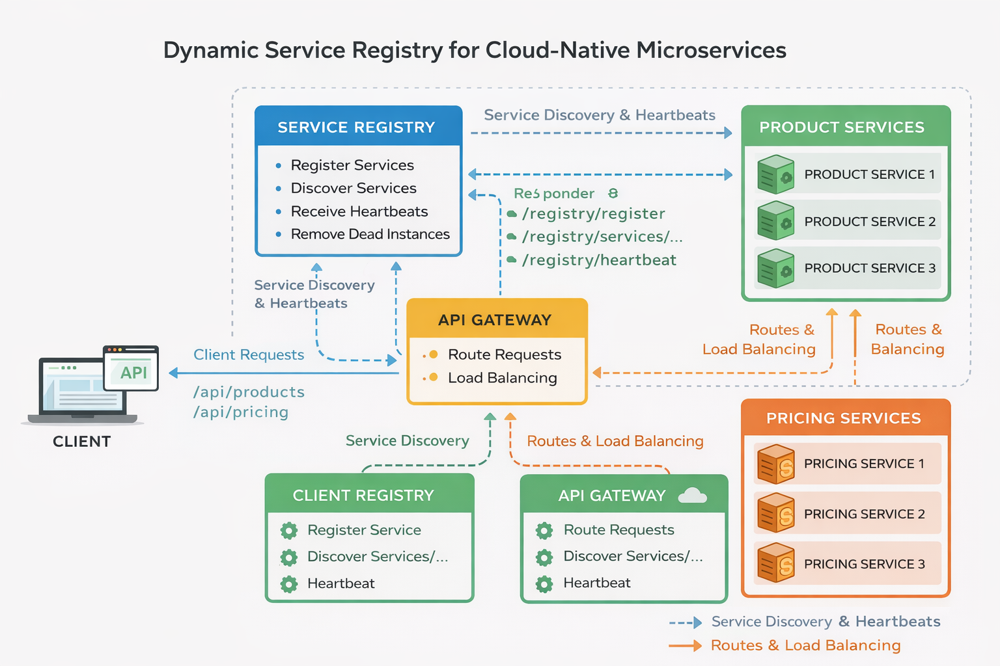

# **Dynamic Service Registry for a Cloud-Native Microservices Ecosystem**

## **Project Overview**

This project implements a **dynamic service discovery system** for a **cloud-native microservices architecture**.

The system consists of **four core components**:

* **Service Registry**
* **API Gateway**
* **Product Service**
* **Pricing Service**

Each microservice automatically:

* Registers itself on startup
* Sends periodic **heartbeat signals**
* Deregisters itself on shutdown

The **API Gateway** acts as the **single entry point** and dynamically routes requests to **healthy service instances** using **client-side discovery**.

---

## **Architecture Diagram**



### **Flow Explanation**

1. Client sends request to **API Gateway**
2. Gateway queries the **Service Registry**
3. Registry returns healthy instances
4. Gateway routes request using **round-robin**
5. Services send heartbeat every **10 seconds**
6. Registry removes services after **30 seconds of inactivity**

---

## **Architecture Components**

### **Service Registry**

Maintains the list of all active service instances.

**Responsibilities:**

* Register new service instances
* Receive heartbeat signals
* Remove inactive services automatically
* Provide service discovery endpoints

---

### **Product Service**

Provides product catalog data.

**Features:**

* Auto-registers with registry
* Sends heartbeat every 10 seconds
* Provides `/products` API

---

### **Pricing Service**

Provides pricing information.

**Features:**

* Auto-registers with registry
* Sends heartbeat
* Provides `/pricing` API

---

### **API Gateway**

Acts as the **single entry point** for all external requests.

**Responsibilities:**

* Discover services dynamically
* Route traffic to healthy instances
* Perform **round-robin load balancing**
* Cache service instances

---

## **Project Structure**

```
dynamic-service-registry
│
├── service-registry/
├── product-service/
├── pricing-service/
├── api-gateway/
├── docker-compose.yml
├── .env.example
└── README.md
```

---

## **Technologies Used**

* Node.js
* Express.js
* Docker
* Docker Compose
* REST APIs
* Microservices Architecture

---

## **Core Features**

### **Automatic Service Registration**

Services register themselves on startup.

---

### **Heartbeat Monitoring**

Services send heartbeat every **10 seconds**.

---

### **Automatic Cleanup**

Registry removes services inactive for **30 seconds**.

---

### **Graceful Deregistration**

Services deregister before shutdown (SIGTERM / SIGINT).

---

### **Dynamic Service Discovery**

Gateway fetches available services dynamically.

---

### **Load Balancing**

Round-robin distribution across instances.

---

### **Docker Containerization**

All services are containerized and orchestrated.

---

## **Health Checks**

Each service exposes a health endpoint:

* Registry → `http://localhost:8500/health`
* Product → `http://localhost:3001/health`
* Pricing → `http://localhost:3002/health`
* Gateway → `http://localhost:8080/health`

These are used by Docker to verify service readiness.

---

## **API Gateway Caching**

The API Gateway **caches service instances** and refreshes them every **5 seconds**.

Benefits:

* Reduces load on registry
* Improves resilience
* Prevents single point of failure

---

## **Graceful Shutdown**

Each service listens for:

* `SIGTERM`
* `SIGINT`

Before shutdown, it:

1. Sends deregistration request
2. Stops accepting traffic

---

## **Running the Application**

### **Start All Services**

```bash
docker-compose up --build
```

---

### **Verify Running Containers**

```bash
docker-compose ps
```

---

## **API Endpoints**

### **Service Registry**

* Register → `POST /registry/register`
* Heartbeat → `POST /registry/heartbeat`
* Deregister → `POST /registry/deregister`
* List All → `GET /registry/services`
* Discover → `GET /registry/services/:serviceName`

---

### **Product Service**

* Health → `/health`
* Products → `/products`

---

### **Pricing Service**

* Health → `/health`
* Pricing → `/pricing`

---

### **API Gateway**

* Products → `/api/products`
* Pricing → `/api/pricing`

---

## **Scaling Services**

```bash
docker-compose up --scale product-service=3
```

This launches multiple instances.

Gateway automatically balances traffic.

---

## **Failover Testing**

```bash
docker ps
docker stop <container_id>
```

After ~30 seconds:

* Registry removes failed instance
* Gateway routes to remaining services

---

## **Quick Test Commands**

```bash
# Gateway test
curl http://localhost:8080/api/products

# Registry test
curl http://localhost:8500/registry/services/product-service

# Scaling
docker-compose up --scale product-service=3

# Failover
docker stop <container_id>
```

---

## **Environment Variables**

`.env.example`

```
REGISTRY_URL=http://service-registry:8500
PORT=3001
```

---

## **Key Concepts Demonstrated**

* Microservices Architecture
* Service Discovery
* API Gateway Pattern
* Health Monitoring
* Distributed Systems
* Load Balancing
* Fault Tolerance
* Docker Orchestration

---

## **Conclusion**

This project demonstrates a **dynamic service discovery system** with:

* Automatic registration
* Health-based routing
* Fault tolerance
* Horizontal scalability

This implementation follows the **client-side service discovery pattern similar to Netflix Eureka** and is suitable for modern cloud-native environments.

---